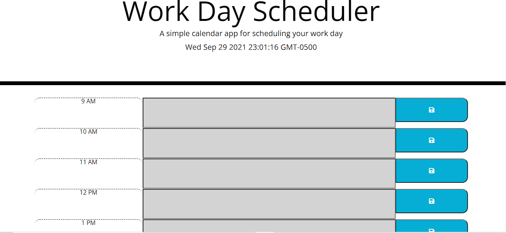

# Homework 4:workdayscheduler

## objectives
 
Created a simple calendar application that allows a user to save events for each hour of the day by modifying starter code. This app will run in the browser and feature dynamically updated HTML and CSS powered by jQuery.

## Screenshot of homepage

## Link to deployed page

You can also refer to this [GitHub Pages](https://sowmyanagayya.github.io/-workdayscheduler/).

